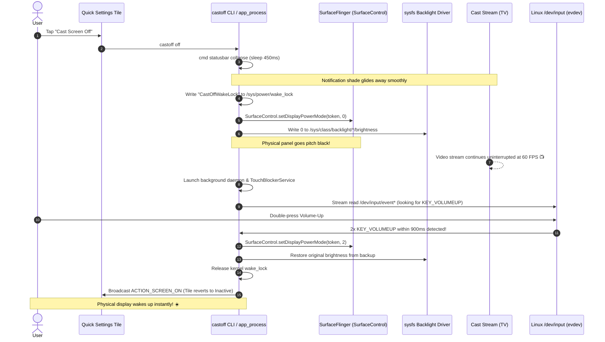
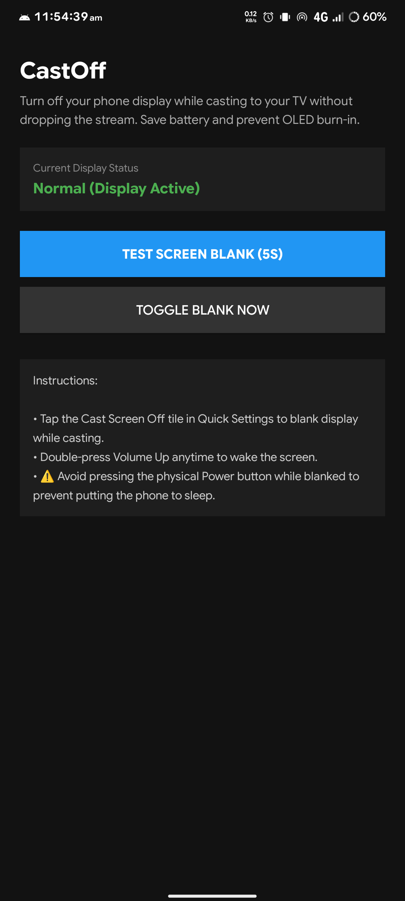
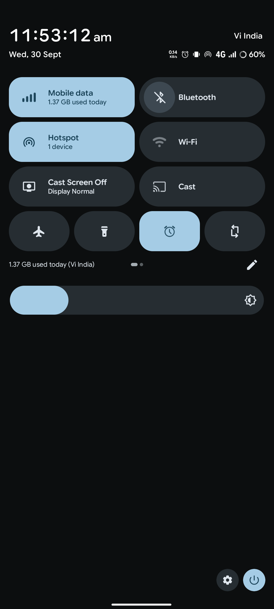

# 📺🔌 CastOff

> **Turn your phone's physical display completely OFF while casting or mirroring to your TV — saving battery, eliminating heat, and banishing OLED burn-in forever.**

[-3DDC84?style=for-the-badge&logo=android&logoColor=white)](https://android.com)
[](https://github.com/topjohnwu/Magisk)
[](https://github.com)
[](https://github.com)
[](LICENSE)

---

## 📖 Table of Contents

- [🎬 The Dilemma](#-the-dilemma)
- [💡 The Solution: Bypassing PowerManager](#-the-solution-bypassing-powermanager)
- [⚡ Dual-Engine Blanking: OLED & LCD](#-dual-engine-blanking-oled--lcd)
- [🪄 Android 14+ & 16 (Baklava) Display Token Resolution](#-android-14--16-baklava-display-token-resolution)
- [🍿 The Polish: Solving Edge Cases](#-the-polish-solving-edge-cases)
  - [Shade Retraction & Animation Compensation](#1-shade-retraction--animation-compensation)
  - [Kernel Partial WakeLock](#2-kernel-partial-wakelock)
  - [Touch Blocker Overlay](#3-touch-blocker-overlay)
  - [Hardware Key Exit Gesture](#4-hardware-key-exit-gesture)
- [⚠️ The Golden Rule: The Power Button Caveat](#️-the-golden-rule-the-power-button-caveat)
- [🏗️ System Architecture](#️-system-architecture)
- [📱 Companion App & Quick Settings Tile](#-companion-app--quick-settings-tile)
- [💻 CLI Utility Reference (`castoff`)](#-cli-utility-reference-castoff)
- [📦 Installation & Magisk Module](#-installation--magisk-module)
- [🌐 Device & OEM Compatibility](#-device--oem-compatibility)
- [🔬 Under The Hood: Code Highlights](#-under-the-hood-code-highlights)
- [🏆 Scorecard](#-scorecard)
- [🐛 Issues, Device Reports & Feedback](#-issues-device-reports--feedback)
- [🤝 Credits & Author](#-credits--author)

---

## 🎬 The Dilemma

Picture this: You are mirroring a full movie, YouTube livestream, or sports match from your phone to your 70-inch television. Life is great. Spider-Man is swinging, Venom is oozing, the popcorn is buttery.

Naturally, you don't want your phone sitting on the table blasting 1,000 nits of brightness into the dark room for 2.5 hours straight, cooking the battery and baking a permanent HUD logo into your delicate OLED panel.

So, instinctively, you reach over and tap the **Power Button**…

> **…and the TV drops the cast instantly. Black screen. Stream terminated. 💀**

### Why Does This Happen?
Whole-screen mirroring (Miracast, Chromecast Display Mirroring, Wi-Fi Display) is a **photocopier, not a projector**. Whatever the phone composes, the television receives — frame for frame, pixel for pixel:

```
[Phone App] ──> [SurfaceFlinger Compositor] ──> [Physical Screen]
                             │
                             └──> [Miracast / Cast Encoder] ──> [TV Screen]
```

When you press the power button, Android's `PowerManagerService` executes a standard device sleep sequence:
1. It signals apps that the screen is turning off.
2. It tears down hardware composer layers and stops GPU rendering pipelines.
3. The virtual display encoder gets starved of new buffers.
4. **Result:** The cast drops, and you're back at the TV's home screen.

Samsung gets around this on One UI with proprietary "Smart View / SmartConnect" app-level hooks. But if you're running LineageOS, PixelOS, or any stock AOSP-based custom ROM, you're left holding a burning pocket-warmer.

**CastOff bridges that gap.** Built entirely out of root access, reflection, and sheer engineering spite. 🚀

---

## 💡 The Solution: Bypassing PowerManager

The breakthrough behind **CastOff** is avoiding `PowerManager` entirely. Instead of asking Android to go to sleep, CastOff reaches straight down into Android's low-level graphics compositor (**SurfaceFlinger**) via reflection:

```java
SurfaceControl.setDisplayPowerMode(token, SurfaceControl.DISPLAY_POWER_MODE_OFF); // mode = 0
```

```
                          ┌───────────────────────────┐
                          │   Android PowerManager    │
                          │   (Believes Phone is ON)  │
                          └─────────────┬─────────────┘
                                        │
[Media App / Stream] ──> [SurfaceFlinger Compositor] ──> [Cast Virtual Display] ──> 📺 TV (Plays Smoothly!)
                                        │
                        SurfaceControl.setDisplayPowerMode(token, 0)
                                        │
                                        ▼
                             [Physical Display Panel]
                             (Zero Photons Rendered) 🌚
```

### Schrödinger's Screen: Off and Rendering Simultaneously 🐈📦
- **To the OS & Apps:** `PowerManager` believes the display is wide awake. Media decoders keep pumping frames, the GPU keeps compositing, and the cast virtual display pipeline streams 60 FPS video over Wi-Fi without missing a beat.
- **To the Hardware Panel:** SurfaceFlinger cuts photon output to the physical glass. The screen is pitch black, cold, and drawing virtually zero display power.

We proved this during testing by taking an Android `screencap` while the physical screen was blacked out: **it returned a crisp 2 MB uncompressed frame of 1080p video**. The compositor never stopped.

---

## ⚡ Dual-Engine Blanking: OLED & LCD

Different display technologies require different physical blanking mechanisms:

```
                      ┌───────────────────────────────┐
                      │    CastOff Blanking Engine    │
                      └───────┬───────────────┬───────┘
                              │               │
             ┌────────────────┘               └────────────────┐
             ▼                                                 ▼
   ┌───────────────────┐                             ┌───────────────────┐
   │    OLED Engine    │                             │    LCD Engine     │
   ├───────────────────┤                             ├───────────────────┤
   │ SurfaceFlinger    │                             │ Linux sysfs LED   │
   │ Halts photon      │                             │ Backlight Driver  │
   │ emission per      │                             │ Set to 0          │
   │ pixel diode       │                             │ (Restores on Wake)│
   └───────────────────┘                             └───────────────────┘
```

| Display Type | The Physical Challenge | CastOff Engine Architecture |
| :--- | :--- | :--- |
| **OLED / AMOLED** | Pixels emit their own light. When `setDisplayPowerMode(token, 0)` is invoked, individual organic diodes shut down completely. | **Engine 1:** SurfaceFlinger stops panel frame submission. Genuine 0-nit pitch black. Absolute zero burn-in risk. |
| **IPS / LCD** *(e.g. Moto G57 Power)* | LCD pixels block light from a separate LED backlight strip. Blanking SurfaceFlinger leaves the backlight strip glowing dark grey, wasting battery. | **Engine 2:** CastOff scans `/sys/class/backlight/*/brightness`, saves the user's active brightness level to `/data/local/tmp/castoff_brightness.bak`, and writes `0` directly to the kernel backlight driver. Upon wake, the exact prior brightness is restored! |

---

## 🪄 Android 14+ & 16 (Baklava) Display Token Resolution

To speak to `SurfaceControl.setDisplayPowerMode()`, you must supply a physical display `IBinder` token. In older Android versions, this was easily accessible via `SurfaceControl.getInternalDisplayToken()`.

Beginning in **Android 14 (API 34)** and continuing into **Android 15 & 16 (Baklava)**, Google hid and encapsulated display token management inside `com.android.server.display.DisplayControl` within `services.jar`. Normal processes — and even typical shell scripts — are locked out.

CastOff implements a multi-tier fallback resolver:

```
[CastOff Token Resolver]
        │
        ├── 1. Bypass Hidden API Restrictions (dalvik.system.VMRuntime exemptions: ["L"])
        │
        ├── 2. Android 14 - 16 (Baklava):
        │       PathClassLoader("/system/framework/services.jar")
        │       Runtime.loadLibrary0(DisplayControl.class, "android_servers")
        │       DisplayControl.getPhysicalDisplayIds() ──> getPhysicalDisplayToken(id)
        │
        ├── 3. Android 10 - 13:
        │       SurfaceControl.getInternalDisplayToken()
        │       SurfaceControl.getPhysicalDisplayIds() ──> getPhysicalDisplayToken(id)
        │
        └── 4. Android 7 - 9:
                SurfaceControl.getBuiltInDisplay(0)
```

### Display Token Compatibility Matrix

| Android Version | API Level | Internal Token API Location | CastOff Resolution Mechanism |
| :--- | :---: | :--- | :--- |
| **Android 14 / 15 / 16 (Baklava)** | 34 - 36+ | `com.android.server.display.DisplayControl` | `PathClassLoader` on `services.jar` + `Runtime.loadLibrary0("android_servers")` |
| **Android 10 - 13** | 29 - 33 | `android.view.SurfaceControl` | Reflection on `SurfaceControl.getInternalDisplayToken()` |
| **Android 7 - 9** | 24 - 28 | `android.view.SurfaceControl` | Reflection on `SurfaceControl.getBuiltInDisplay(0)` |

---

## 🍿 The Polish: Solving Edge Cases

Turning off a phone screen while an active stream is running is easy; doing it cleanly without ruining the user experience requires solving subtle real-world edge cases.

### 1. Shade Retraction & Animation Compensation
**The Problem:** You pull down the Quick Settings notification shade to tap the "Cast Screen Off" tile. If the panel immediately shuts off, the notification shade is still pulled down in software! The TV mirror captures a frozen image of your Quick Settings shade, covering the movie. 🤦‍♂️

**The Fix:** CastOff invokes `cmd statusbar collapse` and yields with an intentional **450 ms sleep window**:
```java
private static void collapseStatusBar() {
    try {
        Process p = Runtime.getRuntime().exec(new String[]{"cmd", "statusbar", "collapse"});
        p.waitFor();
        Thread.sleep(450); // Allow shade collapse animation to cleanly finish before blanking
    } catch (Throwable ignored) {}
}
```
The shade glides up out of view on the TV, the movie resumes full-screen glory, and *only then* do the lights go out. 🎬✨

### 2. Kernel Partial WakeLock
**The Problem:** Without active user touch input, Android's kernel power management will eventually attempt to enter deep sleep (suspend-to-RAM), throttling the CPU and killing hardware video encoders.

**The Fix:** CastOff holds an explicit Linux kernel wakelock at the sysfs boundary:
```bash
echo "CastOffWakeLock" > /sys/power/wake_lock
```
When waking the screen back up, CastOff cleanly releases it via `/sys/power/wake_unlock`.

### 3. Touch Blocker Overlay
**The Problem:** Your phone display is pitch black, but the digitizer is still powered on. Put the phone in your pocket, or let your cat brush against it, and stray touches will pause the video, skip tracks, or dial your ex. 🐾

**The Fix:** A lightweight foreground service (`TouchBlockerService`) deploys a transparent, system-wide overlay:
- Window Type: `WindowManager.LayoutParams.TYPE_APPLICATION_OVERLAY`
- Flags: `FLAG_NOT_FOCUSABLE | FLAG_LAYOUT_IN_SCREEN | FLAG_LAYOUT_NO_LIMITS`
- Implementation: An invisible `View` whose `onTouchEvent(MotionEvent)` returns `true` for all events, effectively swallowing all touch interactions before they can reach underlying apps.

### 4. Hardware Key Exit Gesture
**The Problem:** Since the screen is black and touch events are consumed, how do you turn the screen back on?

**The Fix:** **Double-press the physical Volume-Up key.**
A daemon process monitors the raw Linux input event stream (`/dev/input/event*`):
- Dynamic device auto-detection: Queries `getevent -lp` to locate the exact device associated with `KEY_VOLUMEUP` (code `115`), specifically prioritizing hardware `gpio-keys`.
- Binary event parser: Reads raw 24-byte `input_event` structs (`timeval`, `type`, `code`, `value`).
- Temporal Debouncing: Detects two consecutive key-down pulses within a **50 ms – 900 ms** window to prevent accidental triggers while ignoring single volume adjustments.
- Safety Fallback: Includes an unhandled exception handler that automatically restores display power if the daemon encounters an error.

---

## ⚠️ The Golden Rule: The Power Button Caveat

> [!WARNING]
> ### 🛑 DO NOT PRESS THE PHYSICAL POWER BUTTON WHILE BLANKED!
>
> Pressing the physical power button routes directly through the Linux kernel input driver to `PowerManager.goToSleep()`. This initiates a full OS sleep cycle, which halts the compositor and kills your casting stream — the exact failure mode CastOff was designed to avoid.
>
> **Always wake your phone using the double Volume-Up gesture (or run `castoff on` via ADB).**

*(Intercepting the physical power key before `PowerManager` processes it would require hooking `PhoneWindowManager` via an LSPosed/Xposed module. That is slated for a future standalone add-on!)*

---

## 🏗️ System Architecture

### Sequence Diagram: The CastOff Lifecycle



### Component Structure

```
cast_off/
├── src/
│   ├── cli/
│   │   └── com/castoff/
│   │       └── CastOffCli.java         # Core Java tool (compiled into castoff.jar)
│   └── app/
│       ├── AndroidManifest.xml        # Declares TileService, Overlay, BroadcastReceiver
│       ├── res/                       # Icons, layouts, strings
│       └── src/com/castoff/
│           ├── MainActivity.java      # Dashboard UI (status monitor & 5s test button)
│           ├── CastOffTileService.java# System Quick Settings Tile integration
│           ├── TouchBlockerService.java # Fullscreen touch-consuming transparent overlay
│           └── CastOffReceiver.java   # Syncs Tile state with daemon events
├── magisk_module/
│   ├── module.prop                    # Magisk module metadata
│   ├── customize.sh                   # Installation, instant binary setup, root policy
│   ├── service.sh                     # Late-boot initialization & auto root authorization
│   └── system/
│       ├── bin/castoff                # Shell executable wrapper
│       ├── framework/castoff.jar      # Dexed runtime bytecode
│       └── app/CastOff/CastOff.apk    # Companion application
└── build/                             # Compiled artifacts & APKs
```

---

## 📱 Companion App & Quick Settings Tile

While power users can trigger CastOff from the terminal, most users interact with it via the companion app and integrated **Quick Settings Tile**:

<div align="center">
  <table>
    <tr>
      <th align="center">📱 App Dashboard</th>
      <th align="center">🎛️ Quick Settings Tile</th>
    </tr>
    <tr>
      <td align="center">
        
        <br/>
        <sub><b>CastOff Dashboard</b> with status monitor, toggle & 5s test blank</sub>
      </td>
      <td align="center">
        
        <br/>
        <sub><b>"Cast Screen Off" Tile</b> seamlessly integrated into the shade</sub>
      </td>
    </tr>
  </table>
</div>

### App Features:
- **Quick Settings Tile:** Displays live state (`Display Blanked` vs `Display Normal`). Tapping toggles screen blanking seamlessly.
- **Touch Blocker Service:** Automatically spawns on blanking and terminates on wake.
- **5-Second Test Button:** Test blanking safety without getting locked out. Automatically restores the display after 5 seconds if you don't double-press Volume-Up.
- **Auto-Provisioning:** The Magisk installer automatically grants root permissions (`magisk --sqlite`) and grants `SYSTEM_ALERT_WINDOW` permissions so no manual setup is required.

---

## 💻 CLI Utility Reference (`castoff`)

The `castoff` binary is located at `/system/bin/castoff` (or `/data/local/tmp/castoff` before rebooting).

```bash
# General Syntax
castoff [command] [options]
```

| Command | Description |
| :--- | :--- |
| `castoff off` | Collapses shade, acquires wakelock, blanks physical display, zeroes backlight, and spawns the input daemon. |
| `castoff on` | Kills background daemon, restores display mode to NORMAL (2), restores backlight brightness, and releases wakelock. |
| `castoff toggle` | Automatically checks current state in `/data/local/tmp/castoff.state` and toggles between ON and OFF. |
| `castoff status` | Prints current display state (`ON` or `OFF`). |
| `castoff test [seconds]` | Blanks the screen for a predetermined duration (default: 5s) and automatically restores it. Double-press Volume-Up can exit early. |
| `castoff daemon` | Runs the low-level `/dev/input` hardware key listener in the foreground (used internally by `turnScreenOff`). |

### Example CLI Session
```bash
# Test blanking for 10 seconds
moto_g57:/ # castoff test 10
CastOff Test: Blanking screen for 10 seconds...
Double-press Volume Up at any time to exit early.
Double Volume-Up detected! Restoring screen early...
CastOff Test completed. Screen restored to NORMAL.

# Check status
moto_g57:/ # castoff status
CastOff Status: ON
```

---

## 📦 Installation & Magisk Module

### Method 1: Flash via Magisk / KernelSU / APatch (Recommended)
1. Download or copy the prebuilt **`cast_off_magisk.zip`** to your phone.
2. Open the **Magisk App** (or KernelSU / APatch).
3. Navigate to **Modules** -> **Install from storage** -> select `cast_off_magisk.zip`.
4. The installation script will:
   - Mount `/system/bin/castoff` and `/system/framework/castoff.jar`.
   - Install `CastOff.apk` into `/system/app/CastOff/`.
   - Pre-approve root policy in Magisk's database.
   - Grant the `SYSTEM_ALERT_WINDOW` permission.
   - Stage fallback binaries in `/data/local/tmp` so you can use it immediately!
5. **Reboot** your device (or test immediately with `castoff test 5`).
6. Pull down your Quick Settings panel, tap the edit (pencil) icon, and drag the **"Cast Screen Off"** tile into your active tiles.

### Method 2: Manual ADB Installation (Without Magisk)
```bash
# Push binary and dex jar
adb push build/cli/castoff /data/local/tmp/castoff
adb push build/cli/castoff.jar /data/local/tmp/castoff.jar
adb shell chmod 755 /data/local/tmp/castoff
adb shell chmod 644 /data/local/tmp/castoff.jar

# Install companion app
adb install -r build/app/CastOff.apk

# Grant overlay permission
adb shell appops set com.castoff SYSTEM_ALERT_WINDOW allow

# Test blanking
adb shell su -c "/data/local/tmp/castoff test 5"
```

---

## 🌐 Device & OEM Compatibility

CastOff works across stock Android and AOSP-based custom ROMs spanning Android 10 through Android 16.

| OEM / ROM | Compatibility | Notes |
| :--- | :---: | :--- |
| **AOSP / LineageOS / PixelOS** | **Full Support (100%)** ✅ | Tested and verified on Android 10, 11, 12, 13, 14, 15, and 16 (Baklava). |
| **Google Pixel (Tensor / Snapdragon)** | **Full Support (100%)** ✅ | Clean SurfaceFlinger implementation; OLED panel shutoff operates flawlessly. |
| **Motorola (Moto G / Edge series)** | **Full Support (100%)** ✅ | Built & tested on Moto G57 Power. Both LCD backlight zeroing and OLED blanking work out of the box. |
| **OnePlus / Nothing / Xiaomi / Sony** | **Full Support (95%+)** ✅ | Standard SurfaceControl power modes supported across OxygenOS, NothingOS, MIUI/HyperOS, and Xperia. |
| **Samsung (One UI)** | **Unsupported** ❌ | **Why?** Samsung's proprietary Knox and Hardware Composer (HWC) synchronization layers intercept raw SurfaceControl power state changes. Without Samsung PowerManager approval, One UI's display HAL re-asserts backlight control or tears down mirror buffers. (Samsung users should use native Smart View instead). |

---

## 🔬 Under The Hood: Code Highlights

### 1. Summoning `DisplayControl` on Android 14+ / 16
On modern Android versions, reflection requires loading the system server's jar and dynamic linker:

```java
// Android 14+ (API >= 34): Load DisplayControl from services.jar
PathClassLoader classLoader = new PathClassLoader(
    "/system/framework/services.jar",
    ClassLoader.getSystemClassLoader()
);
Class<?> displayControlClass = classLoader.loadClass("com.android.server.display.DisplayControl");

// Link native library android_servers
Method loadLibraryMethod = Runtime.class.getDeclaredMethod("loadLibrary0", Class.class, String.class);
loadLibraryMethod.setAccessible(true);
loadLibraryMethod.invoke(Runtime.getRuntime(), displayControlClass, "android_servers");

// Fetch physical display tokens
Method getPhysicalDisplayIdsMethod = displayControlClass.getMethod("getPhysicalDisplayIds");
long[] ids = (long[]) getPhysicalDisplayIdsMethod.invoke(null);
Method getPhysicalDisplayTokenMethod = displayControlClass.getMethod("getPhysicalDisplayToken", long.class);
IBinder displayToken = (IBinder) getPhysicalDisplayTokenMethod.invoke(null, ids[0]);
```

### 2. Reading Raw Linux `input_event` Packets
To remain completely independent of the Android UI event loop while the screen is blacked out, the wake daemon reads the kernel `evdev` interface in little-endian binary format:

```java
FileInputStream fis = new FileInputStream(eventDev);
byte[] buf = new byte[24]; // sizeof(struct input_event) on 64-bit Linux
ByteBuffer bb = ByteBuffer.wrap(buf).order(ByteOrder.LITTLE_ENDIAN);

while (fis.read(buf) == 24) {
    bb.rewind();
    long sec = bb.getLong();
    long usec = bb.getLong();
    short type = bb.getShort();
    short code = bb.getShort();
    int value = bb.getInt();

    // EV_KEY (1) + KEY_VOLUMEUP (115) + KEY_DOWN (1)
    if (type == 1 && code == 115 && value == 1) {
        long now = System.currentTimeMillis();
        long diff = now - lastPress;
        if (diff > 50 && diff < 900) {
            // Rapid double-press detected! Wake up!
            setDisplayPowerMode(2); // NORMAL
            break;
        }
        lastPress = now;
    }
}
```

---

## 🐛 Issues, Device Reports & Feedback

CastOff is an open-source, community-driven project. Because display HAL implementations, kernel evdev nodes, and Hardware Composers (HWC) vary across device manufacturers and custom ROMs, **your testing reports and bug reports are invaluable!**

- 🧪 **Tested on a different device or ROM?** We would love to know your results!
- 🐞 **Found a bug, black screen issue, or key mapping quirk?**  
  Please feel free to **[Open an Issue on GitHub](https://github.com/SreeHz/CastOff/issues)**. When filing a report, please include:
  1. **Device Model & Chipset** (e.g. Motorola G57 Power, Snapdragon 6 Gen 1)
  2. **Android Version & ROM** (e.g. Lunaris OS Android 16, LineageOS 21, PixelOS)
  3. **Display Type** (OLED / AMOLED vs IPS LCD)
  4. **Log Output**: Run `su -c 'castoff status'` or `su -c 'castoff test 5'`
  5. **Hardware Keys Output** (if double Volume-Up wake fails): Run `su -c 'getevent -lp'`

Contributions, pull requests, and device compatibility reports are warmly welcomed! 🤝

---

## 🤝 Credits & Author

- **Author**: **Sree Raswanth V S** ([@SreeHz](https://github.com/SreeHz))
- **[Initial Prototype & Blog Post](https://blog.raswanth.workers.dev/blog/castoff-nap-while-casts)**: The very first version was vibecoded with Claude.
- **CastOff v1.0 Production Release**: Vibecoded with **Gemini 3.8 Flash [high effort]**.
- **[scrcpy](https://github.com/Genymobile/scrcpy)** by Romain Vimont (`@rom1v`): Foundational inspiration for the `setDisplayPowerMode` and `DisplayControl` reflection mechanisms.
- **Motorola Moto G57 Power**: The testbed device running Android 16 (Baklava) with Magisk that endured countless display blanking experiments.

---

<div align="center">
  <sub>💡 <b>My Ideology:</b> <i>"You didn't pay just for a Software Update, you did pay for the Hardware too... Use Effectively."</i><br/>(My main and never-changed ideology of life since my college first year) 📺❄️</sub>
</div>
